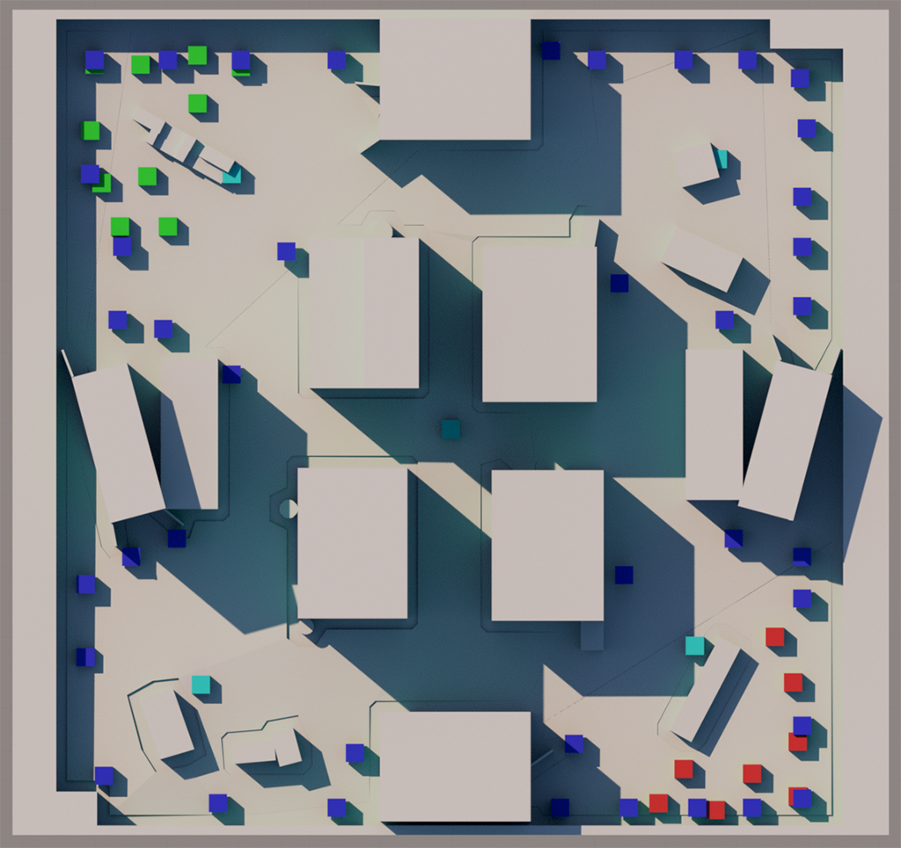
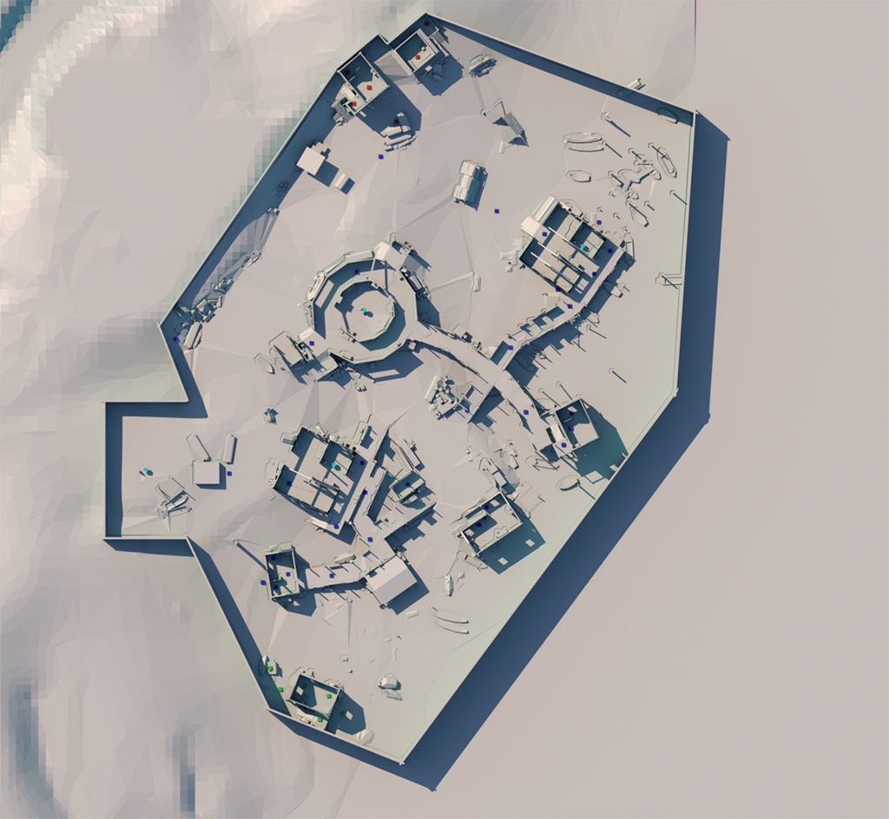
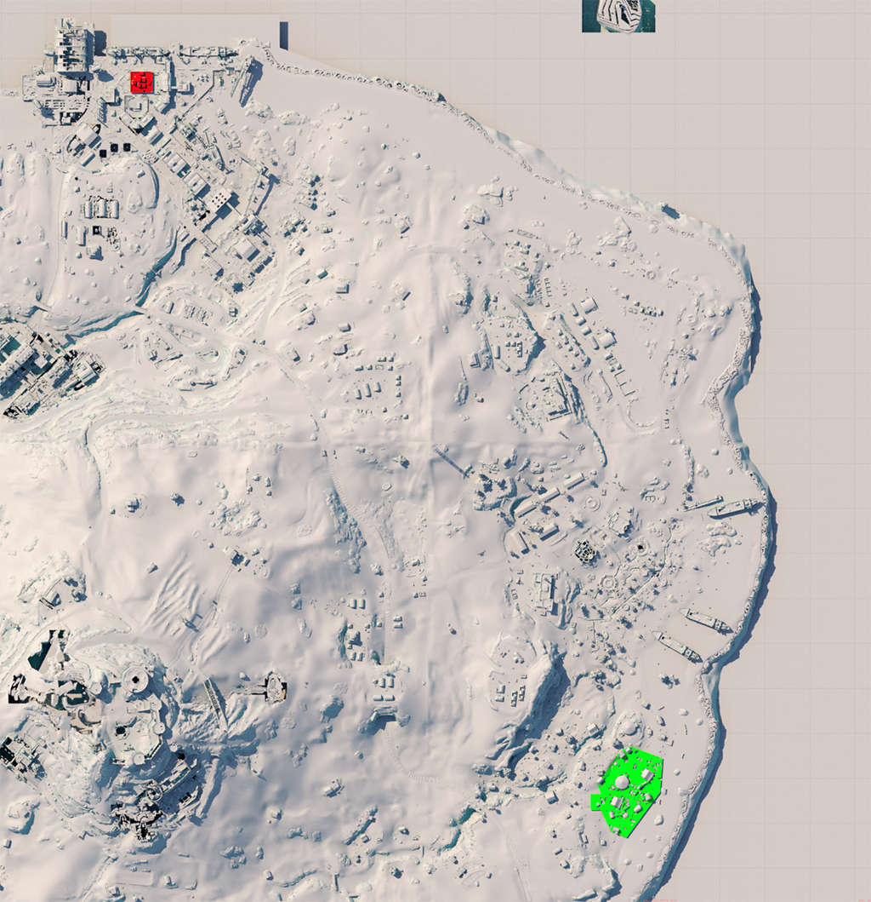

MadronaMPGeo is an auxiliary data set for the [MadronaMPEnv](https://github.com/Activision/madrona-mp-env) project. MapdronaMPEnv is an experimental learning environment for training AI agents to play competitive multiplayer games with reinforcement learning. 

The data in data/enviroment.usd includes simplified versions of two Call of Duty® multiplayer maps containing collision data, spawn points and the navigation mesh.

Map 1:

Map 2:

Both of them are stand-alone maps, but also can be found as sections in the Call of Duty®: Warzone™ map [Caldera](https://github.com/Activision/caldera). The scene files live in data/environments.usd which can be imported in most third-party applications, or inspected in script using the [OpenUSD](https://openusd.org/release/index.html) Python [bindings](https://pypi.org/project/usd-core/).

The first map (red) can be found in the map_docks section of Caldera while the second map (green) can be found in the map_beachhead district. 

Copyright © 2025 Activision Publishing, Inc.
